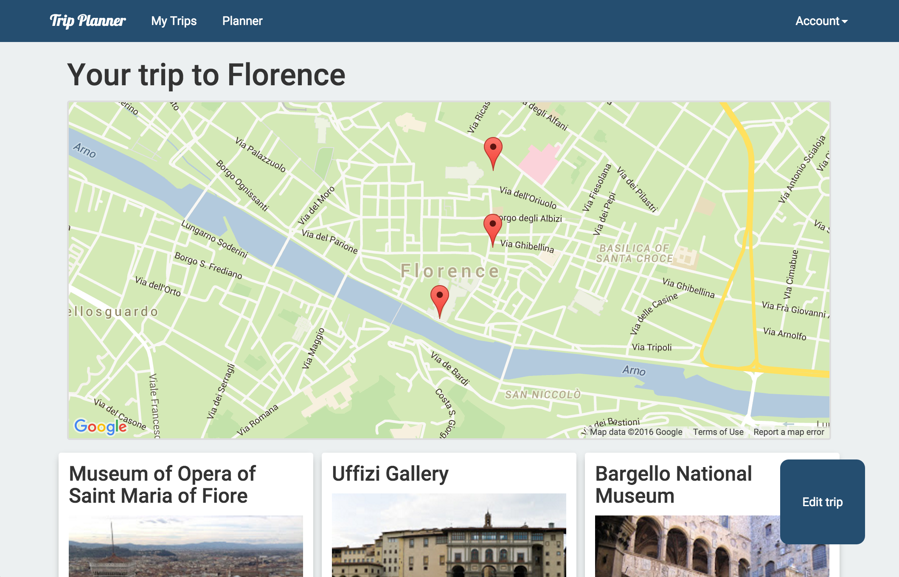

# Trip Planner

Group Node.js project.

</img>

## Contributors

* [Chiara Buzzi](https://github.com/ChiaraBuzzi)
* [Richard Gurney](https://github.com/richgurney)
* David Leslie
* [Robin Scott](https://github.com/robascott)

## About

Enter a city and Trip Planner will show you various places and attractions you might be interested in visiting. Selecting a suggestion adds it to your trip plan. Click *Done* to see the places you selected displayed on a map.

The app retrieves its data from the Places Library within the Google Maps API.

## Technology

Node.js, Express.js, MongoDB, Mongoose, Passport, JSON Web Token, Ajax, Bootstrap, Google Maps API

## Technical Requirements

The app must:

* **Use Mongo & Express** to build an API and a front-end that consumes it
* **Create an API using at least 2 related models**, one of which should be a user
* Include **all major CRUD functions** in a **RESTful API** for at least one of those model
* **Consume your own API** by making your front-end with HTML, Javascript, & jQuery
* **Add authentication to your API** to restrict access to appropriate users
* **Craft thoughtful user stories together**, as a team
* **Manage team contributions and collaboration** using a standard Git flow on Github
* Layout and style your front-end with **clean & well-formatted CSS**
* **Deploy your application online** so it's publicly accessible

## How to run

    npm install && npm start